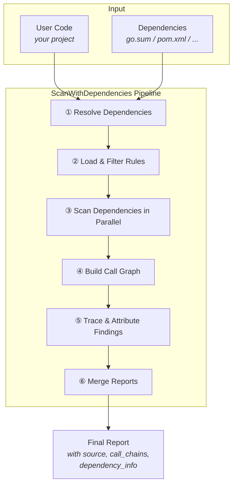
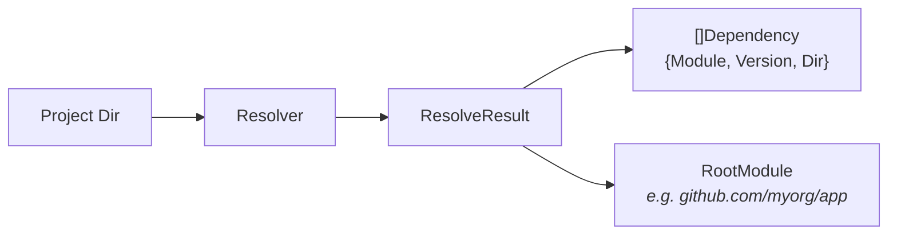
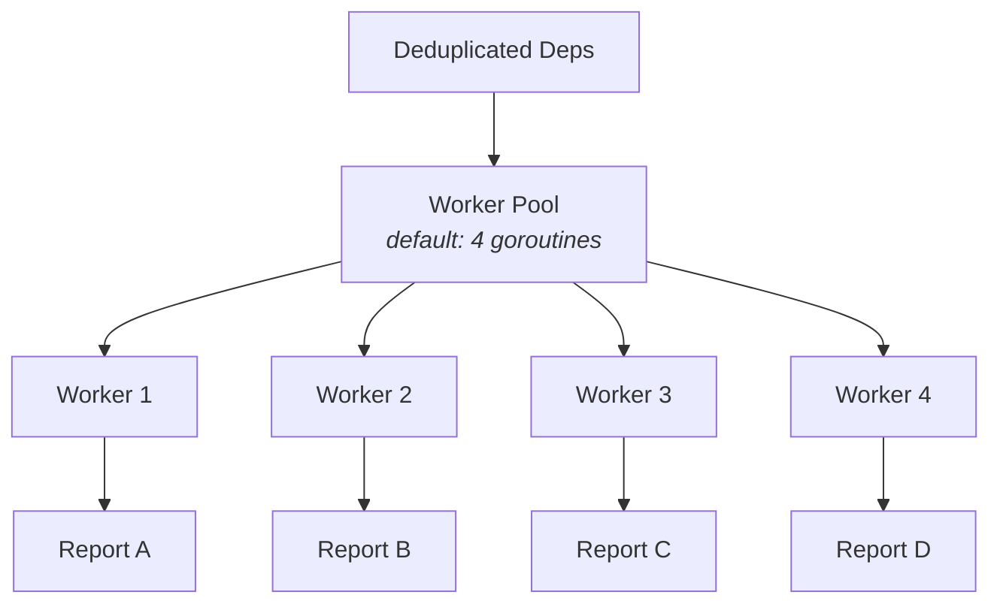
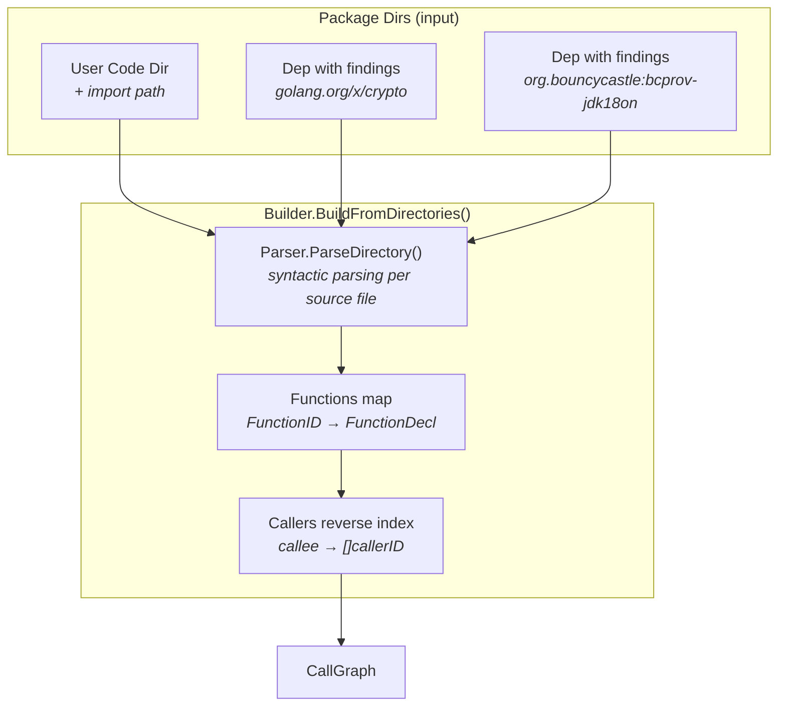
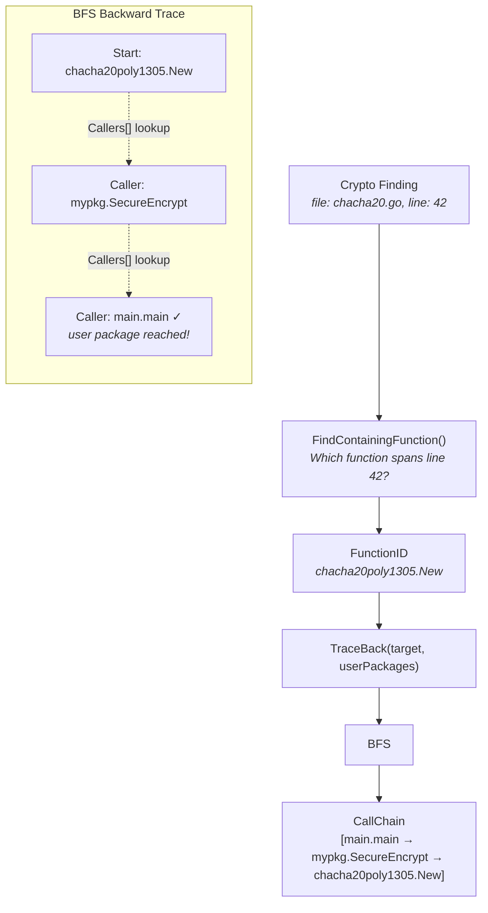
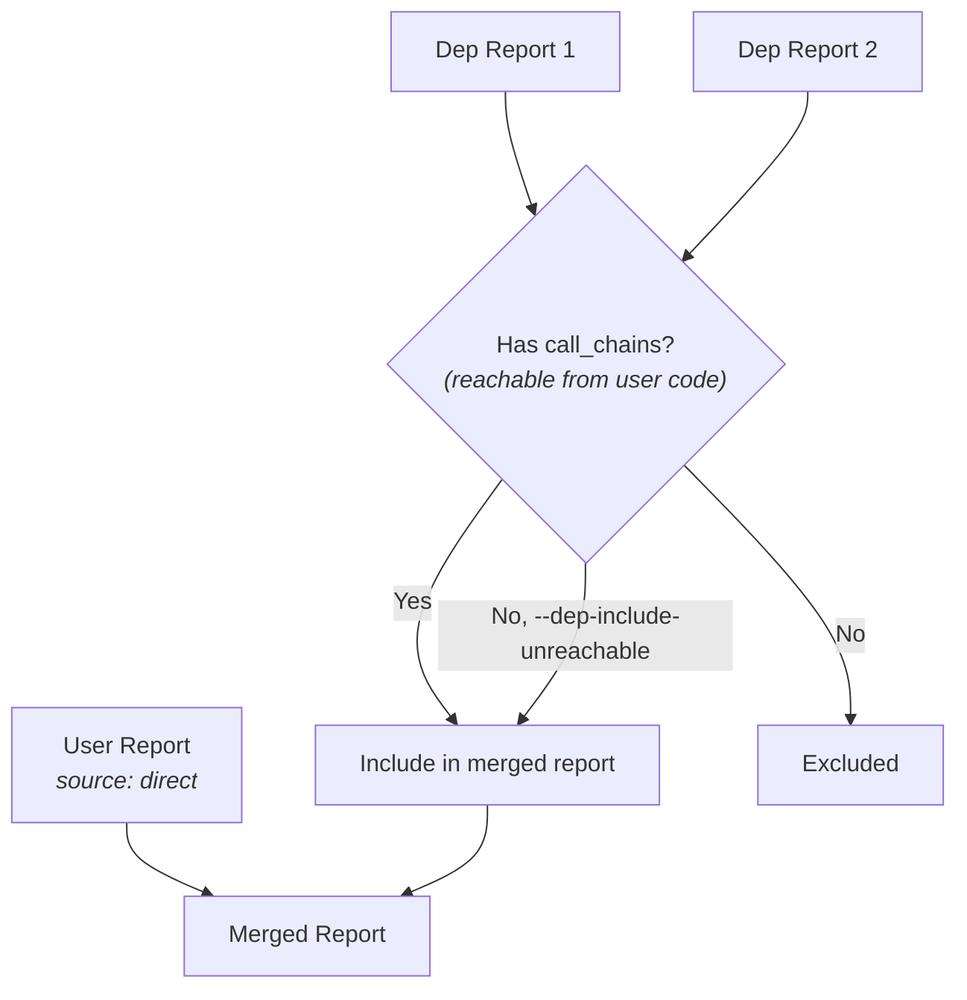
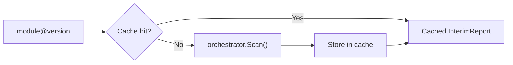

# Dependency Scanning & Call Chain Attribution

This document explains how crypto-finder discovers cryptographic usage in project dependencies and traces it back to user code through call graph analysis.

## Overview

When `--scan-dependencies` is enabled, crypto-finder goes beyond scanning the user's source code. It resolves the project's dependency tree, scans each dependency for cryptographic usage, builds a cross-package call graph, and traces each finding back to the user's code to answer: **"Does my code actually reach this crypto function?"**



## The Six-Step Pipeline

The full pipeline lives in [`DependencyScanner.ScanWithDependencies()`](../internal/engine/dependency_scanner.go). Here's what each step does and why.

### Step 1: Resolve Dependencies



The [`Resolver` interface](../internal/dependency/resolver.go) discovers all dependencies and locates their source code on disk. Each ecosystem has its own resolver implementation (see [Supported Ecosystems](#supported-ecosystems) below). Each `Dependency` carries:

| Field     | Go Example                          | Java Example                     | Python Example                   | Rust Example                     | Purpose                          |
|-----------|-------------------------------------|----------------------------------|----------------------------------|----------------------------------|----------------------------------|
| `Module`  | `golang.org/x/crypto`              | `org.bouncycastle:bcprov-jdk18on`| `cryptography`                   | `ring`                           | Import path / coordinate         |
| `Version` | `v0.17.0`                           | `1.77`                           | `42.0.5`                         | `0.17.8`                         | Resolved version                 |
| `Dir`     | `~/go/pkg/mod/golang.org/x/crypto@v0.17.0` | `~/.crypto-finder/cache/sources/org.bouncycastle:bcprov-jdk18on/1.77/` | `~/.local/lib/python3.x/site-packages/cryptography/` | `~/.cargo/registry/src/.../ring-0.17.8/` | Filesystem path to scan |

The `RootModule` (e.g. `github.com/myorg/app` for Go, `com.myorg` for Java) is used later to determine which packages are "user code" vs. "dependency code".

### Step 2: Load & Filter Rules

Rules are pre-loaded once and filtered to the ecosystem's language(s). For a Go project, only `go` rules are kept; for Java, only `java` rules. This avoids running irrelevant rules against source code, significantly reducing scanner overhead.

### Step 3: Scan Dependencies in Parallel



Each dependency is scanned independently using the same `Orchestrator.Scan()` pipeline as user code (Semgrep/OpenGrep rules → deduplication → enrichment). Dependencies are deduplicated by `module@version` to avoid scanning the same package twice.

All scanned dependencies proceed to step 4 — even those without crypto findings contribute type declarations needed for accurate call resolution (e.g., `JwtBuilder` interface declarations in `jjwt-api`).

### Step 4: Build the Call Graph

This is where the architecture gets interesting. The call graph builder uses **syntactic parsing** to process source files, which means it works on raw source without needing a full Go toolchain, Java compiler, Python interpreter, or Rust toolchain. The [`Parser` interface](../internal/callgraph/builder.go) abstracts all language-specific behavior:

```go
type Parser interface {
    ParseDirectory(dir string, packagePath string) ([]*FileAnalysis, error)
    SkipDirs() map[string]bool
    SubPackagePath(parentPath, dirName string) string
    PackageSeparator() string  // "/" for Go, "." for Java/Python, "::" for Rust
}
```

The [`NewParserForEcosystem()`](../internal/callgraph/parser_registry.go) factory selects the right parser (`GoParser`, `JavaParser`, `PythonParser`, or `RustParser`) based on the detected ecosystem.



#### What the parser extracts

Each language parser extracts the same semantic information into the shared `FileAnalysis` / `FunctionDecl` structures. For Go (`.go` files, excluding `_test.go`):

| Extracted | Example | Stored As |
|-----------|---------|-----------|
| Package imports | `import "crypto/aes"` | `Imports["aes"] = "crypto/aes"` |
| Function declarations | `func Encrypt(...)` | `FunctionDecl{ID, FilePath, StartLine, EndLine, Calls}` |
| Method declarations | `func (b *Block) Seal(...)` | Same, with `Type = "*Block"` |
| Call expressions | `aes.NewCipher(key)` | `FunctionCall{Callee: {Package: "crypto/aes", Name: "NewCipher"}}` |

For Java (`.java` files):

| Extracted | Example | Stored As |
|-----------|---------|-----------|
| Package declaration | `package javax.crypto;` | `PackagePath = "javax.crypto"` |
| Imports (explicit) | `import javax.crypto.Cipher;` | `Imports["Cipher"] = "javax.crypto"` |
| Imports (wildcard) | `import java.security.*;` | `WildcardImports = ["java.security"]` |
| Class methods | `class Cipher { getInstance(...) }` | `FunctionDecl{..., Type: "Cipher", Name: "getInstance"}` |
| Constructors | `new SecretKeySpec(...)` | Call to `FunctionID{..., Type: "SecretKeySpec", Name: "<init>"}` |
| Method invocations | `Cipher.getInstance("AES")` | Resolved via imports → `FunctionID{Package: "javax.crypto", Type: "Cipher", Name: "getInstance"}` |
| Local variable types | `Cipher cipher = Cipher.getInstance(...)` | Enables `cipher.doFinal()` → resolves `cipher` to `Cipher` type |

For Python (`.py` files, excluding `test_*.py` and `*_test.py`):

| Extracted | Example | Stored As |
|-----------|---------|-----------|
| Import statements | `import hashlib` | `Imports["hashlib"] = "hashlib"` |
| From imports | `from cryptography.hazmat.primitives import Cipher` | `Imports["Cipher"] = "cryptography.hazmat.primitives"` |
| Wildcard imports | `from hashlib import *` | `WildcardImports = ["hashlib"]` |
| Aliased imports | `import hashlib as hl` | `Imports["hl"] = "hashlib"` |
| Function definitions | `def encrypt(key, data):` | `FunctionDecl{ID, FilePath, StartLine, EndLine, Calls}` |
| Class methods | `class Cipher: def __init__(self):` | `FunctionDecl{..., Type: "Cipher", Name: "<init>"}` |
| Attribute calls | `hashlib.sha256()` | Resolved via imports → `FunctionID{Package: "hashlib", Name: "sha256"}` |
| Chained calls | `cryptography.hazmat.primitives.hashes.SHA256()` | Resolved via first segment import |
| `self` calls | `self.encrypt()` | `FunctionID{Package: current_package, Name: "encrypt"}` |

For Rust (`.rs` files, excluding `*_test.rs` and `tests.rs`):

| Extracted | Example | Stored As |
|-----------|---------|-----------|
| Use declarations | `use ring::aead::Aead;` | `Imports["Aead"] = "ring::aead"` |
| Scoped use lists | `use ring::aead::{Aead, AeadCore};` | `Imports["Aead"] = "ring::aead"`, `Imports["AeadCore"] = "ring::aead"` |
| Wildcard use | `use ring::aead::*;` | `WildcardImports = ["ring::aead"]` |
| Free functions | `fn encrypt(key: &[u8]) {...}` | `FunctionDecl{ID, FilePath, StartLine, EndLine, Calls}` |
| Impl methods | `impl Aead { fn new(...) {...} }` | `FunctionDecl{..., Type: "Aead", Name: "new"}` |
| Scoped calls | `Aead::new(...)` | Resolved via imports → `FunctionID{Package: "ring::aead", Type: "Aead", Name: "new"}` |
| Field calls | `self.encrypt(...)` | `FunctionID{Package: current_module, Name: "encrypt"}` |

#### The two data structures

The `CallGraph` holds two maps:

```
Functions:  "crypto/aes.NewCipher"         → FunctionDecl{...}
            "example.com/app.Encrypt"      → FunctionDecl{Calls: [...]}
            "example.com/app.main"         → FunctionDecl{Calls: [...]}

Callers:    "crypto/aes.NewCipher"         → ["example.com/app.Encrypt"]
            "example.com/app.Encrypt"      → ["example.com/app.main"]
```

- **`Functions`** maps `FunctionID.String()` → `*FunctionDecl` (forward: function → its outgoing calls)
- **`Callers`** maps callee → `[]callerID` (reverse: who calls this function?)

The reverse index is what enables **backward tracing** — starting from a crypto finding and walking up to user code.

#### Type resolution

After building the caller index, the builder runs additional resolution passes to improve type accuracy:

1. **`TypeResolver`** (language-specific): For Java, a bytecode-based resolver reads `.class` files from Maven-cached JARs to extract fully-qualified method signatures. This provides accurate parameter types (e.g., `io.jsonwebtoken.SignatureAlgorithm` instead of generic `K`) and return types for fluent chain resolution. The `TypeResolver` interface is extensible — each language can implement its own approach (Go: `go/types`, Python: `.pyi` stubs, Rust: `rust-analyzer`).

2. **Fluent chain resolution**: For chained calls like `Jwts.builder().setId(id).signWith(algo, key)`, return types are propagated through the chain. If `builder()` returns `JwtBuilder`, then `setId()` is resolved as `JwtBuilder.setId`. Interface inheritance is also followed (e.g., `JwtBuilder` extends `ClaimsMutator`, so `setId` resolves to `ClaimsMutator.setId`).

3. **Argument source tracing**: For each function call, the parser traces where argument values come from — literal constants, local variables, class fields, method parameters, or call results. This produces recursive `source_nodes` showing the data flow into each argument.

### Step 5: Trace & Attribute Findings

This is the core of the attribution system. For each crypto finding in a dependency:



#### How `TraceBack` works (BFS)

1. **Start** with the target function (where the crypto finding was detected)
2. **Look up** all callers via the reverse index (`graph.Callers[targetKey]`)
3. **Prepend** each caller to the chain being built (so the chain grows backward: `[caller, ...existing]`)
4. **Terminate** when a root function is reached (a function with no callers, e.g., `main`)
5. **Validate** that the complete chain passes through at least one user-package function
6. **Cycle detection** prevents infinite loops in recursive call graphs
7. **Return** all complete chains (BFS finds all paths from entry points to the crypto call site)

The result is an ordered array: **`[program_entry_point, ..., intermediate, ..., crypto_call_site]`** — array position `[i]` calls position `[i+1]`.

#### Attribution output

After tracing, each finding gets structured fields:

**Dependency finding:**
```json
{
  "source": "dependency",
  "finding_id": "a1b2c3d4",
  "dependency_info": {
    "module": "golang.org/x/crypto",
    "version": "v0.17.0",
    "function": "golang.org/x/crypto/chacha20poly1305.New"
  },
  "call_chains": [
    [
      {"function_name": "main", "namespace": "example.com/app", "file_path": "main.go", "line": 15},
      {"function_name": "SecureEncrypt", "namespace": "example.com/app/mypkg", "file_path": "mypkg/crypto.go", "line": 8},
      {"function_name": "New", "namespace": "golang.org/x/crypto/chacha20poly1305", "file_path": "golang.org/x/crypto@v0.17.0/chacha20.go", "line": 42}
    ]
  ]
}
```

**User code finding** (enriched with intra-project call chain):
```json
{
  "source": "direct",
  "finding_id": "e5f6a7b8",
  "call_chains": [
    [
      {"function_name": "main", "namespace": "example.com/app", "file_path": "main.go", "line": 15},
      {"function_name": "SecureEncrypt", "namespace": "example.com/app/mypkg", "file_path": "mypkg/crypto.go", "line": 8}
    ]
  ]
}
```

### Step 6: Merge Reports



By default, only **reachable** dependency findings (those with a non-empty `call_chains`) are included. The `--dep-include-unreachable` flag overrides this to include all dependency findings regardless of traceability.

User code findings are always included and marked with `source: "direct"`.

---

## Practical Walkthrough

This section traces the entire pipeline using the test project at `testdata/projects/go_with_crypto_dep/`. Every value shown is real — produced by running `crypto-finder scan --scan-dependencies` against this project.

### The Source Code

Three files make up the project:

**`go.mod`** — declares one direct dependency:
```
module example.com/crypto-test
go 1.21
require golang.org/x/crypto v0.31.0
require golang.org/x/sys v0.28.0 // indirect
```

**`main.go`** — the entry point. Does **not** use crypto directly:
```go
package main

import "example.com/crypto-test/mypkg"

func main() {
    key := make([]byte, 32)
    message := []byte("Hello, crypto-finder dependency scanning!")

    encrypted, err := mypkg.SecureEncrypt(key, message)   // line 14
    decrypted, err := mypkg.SecureDecrypt(key, encrypted)  // line 19
}
```

**`mypkg/crypto.go`** — user's wrapper package. Uses crypto from a dependency:
```go
package mypkg

import (
    "crypto/rand"
    "golang.org/x/crypto/chacha20poly1305"
)

func SecureEncrypt(key []byte, plaintext []byte) ([]byte, error) {  // line 12
    aead, err := chacha20poly1305.New(key)                          // line 13 — crypto!
    nonce := make([]byte, aead.NonceSize())
    rand.Read(nonce)                                                // line 19 — crypto!
    ciphertext := aead.Seal(nonce, nonce, plaintext, nil)
    return ciphertext, nil
}

func SecureDecrypt(key []byte, ciphertext []byte) ([]byte, error) { // line 28
    aead, err := chacha20poly1305.New(key)                          // line 29 — crypto!
    // ...
}
```

### Step 1: Scan User Code (the normal scan)

The orchestrator runs Semgrep/OpenGrep rules against user code. It finds **3 assets** in `mypkg/crypto.go`:

| Line | Match | Rule |
|------|-------|------|
| 13 | `chacha20poly1305.New(key)` | `go.xcrypto.chacha20poly1305.aead` |
| 19 | `rand.Read(nonce)` | `go.crypto.rand.usage` |
| 29 | `chacha20poly1305.New(key)` | `go.xcrypto.chacha20poly1305.aead` |

This produces the **user report**. At this point there are no `source`, `call_chain`, or `dependency_info` fields — just raw findings.

### Step 2: Resolve Dependencies

The Go resolver runs `go list -m -json all`. It returns:

```
RootModule: "example.com/crypto-test"

Dependencies:
  Module                    Version   Dir
  golang.org/x/crypto       v0.31.0   ~/go/pkg/mod/golang.org/x/crypto@v0.31.0
  golang.org/x/sys          v0.28.0   ~/go/pkg/mod/golang.org/x/sys@v0.28.0
```

The `RootModule` (`example.com/crypto-test`) is the key — any package whose import path starts with this prefix is considered **user code**. Everything else is a dependency.

### Step 3: Scan Dependencies in Parallel

Each dependency gets scanned with the same rules, limited to Go rules only:

| Dependency | Crypto Assets Found | Why |
|------------|--------------------:|-----|
| `golang.org/x/crypto` | ~870 | It **is** a crypto library — virtually every file matches |
| `golang.org/x/sys` | ~3 | False positives (function names like `Generate` matching crypto rules) |

Total: **~873 dependency findings**. Both dependencies have findings, so both proceed to step 4.

### Step 4: Build the Call Graph

The builder receives three package directories:

```
PackageDirs = [
    {Dir: ".../go_with_crypto_dep",           ImportPath: "example.com/crypto-test"},
    {Dir: ".../golang.org/x/crypto@v0.31.0",  ImportPath: "golang.org/x/crypto"},
    {Dir: ".../golang.org/x/sys@v0.28.0",     ImportPath: "golang.org/x/sys"},
]
```

The syntactic parsing parser processes every `.go` file and extracts function declarations with their calls.

**From `main.go`:**
```
FunctionDecl: example.com/crypto-test.main
  File: main.go, Lines: 10–26
  Calls:
    → example.com/crypto-test/mypkg.SecureEncrypt  (line 14)
    → example.com/crypto-test/mypkg.SecureDecrypt  (line 19)
```

**From `mypkg/crypto.go`:**
```
FunctionDecl: example.com/crypto-test/mypkg.SecureEncrypt
  File: mypkg/crypto.go, Lines: 12–25
  Calls:
    → golang.org/x/crypto/chacha20poly1305.New     (line 13)
    → crypto/rand.Read                             (line 19)

FunctionDecl: example.com/crypto-test/mypkg.SecureDecrypt
  File: mypkg/crypto.go, Lines: 28–46
  Calls:
    → golang.org/x/crypto/chacha20poly1305.New     (line 29)
```

**From `golang.org/x/crypto/...`:** hundreds more function declarations.

Then `buildCallerIndex()` creates the **reverse index** (callee → who calls it):

```
Callers["example.com/crypto-test/mypkg.SecureEncrypt"]
    = ["example.com/crypto-test.main"]

Callers["example.com/crypto-test/mypkg.SecureDecrypt"]
    = ["example.com/crypto-test.main"]

Callers["golang.org/x/crypto/chacha20poly1305.New"]
    = ["example.com/crypto-test/mypkg.SecureEncrypt",
       "example.com/crypto-test/mypkg.SecureDecrypt"]
```

This reverse index is what makes backward tracing possible.

### Step 5: Trace & Attribute

The system now traces **each finding** back through the call graph to user code. Three different scenarios play out:

#### Scenario A: User finding — `chacha20poly1305.New` at line 13

This finding is in `mypkg/crypto.go` (user code). The enrichment flow:

**5a-1. Find the containing function:**

`FindContainingFunction("mypkg/crypto.go", 13)` iterates all `FunctionDecl`s, looking for one whose `FilePath` matches and whose `StartLine..EndLine` spans line 13. It finds **`SecureEncrypt`** (lines 12–25).

**5a-2. Trace back to entry point:**

`TraceBack(SecureEncrypt, userPackages={"example.com/crypto-test"}, maxDepth=0)`:

```
BFS queue: [ [SecureEncrypt] ]

Iteration 1:
  chain = [SecureEncrypt]
  head  = SecureEncrypt
  Look up Callers["...mypkg.SecureEncrypt"] → ["...main"]
  Prepend caller: chain becomes [main, SecureEncrypt]
  → push to queue

Iteration 2:
  chain = [main, SecureEncrypt]
  head  = main
  Look up Callers["...main"] → [] (no callers — root function)
  Chain reaches user code? YES (both functions are user code)
  Chain length > 1? YES
  → CHAIN COMPLETE! Add to results.
```

**5a-3. Result:**

```json
"source": "direct",
"finding_id": "a1b2c3d4",
"call_chains": [
    [
        {"function_name": "main", "namespace": "example.com/crypto-test", "file_path": "main.go", "line": 14},
        {"function_name": "SecureEncrypt", "namespace": "example.com/crypto-test/mypkg", "file_path": "mypkg/crypto.go", "line": 12}
    ]
]
```

Note: `main`'s line is **14** (the line where `main` *calls* `SecureEncrypt`), not line 10 where `main` is declared. This is because `findCallLine()` searches `main`'s `Calls` list for the specific call to `SecureEncrypt` and returns that call-site line number.

#### Scenario B: User finding — `chacha20poly1305.New` at line 29

Same logic, but traces through `SecureDecrypt`:

```
FindContainingFunction("mypkg/crypto.go", 29) → SecureDecrypt (lines 28–46)

TraceBack(SecureDecrypt):
  [SecureDecrypt]
  → prepend caller → [main, SecureDecrypt]
  → main has no callers (root function), chain reaches user code → CHAIN COMPLETE
```

```json
"source": "direct",
"finding_id": "b2c3d4e5",
"call_chains": [
    [
        {"function_name": "main", "namespace": "example.com/crypto-test", "file_path": "main.go", "line": 19},
        {"function_name": "SecureDecrypt", "namespace": "example.com/crypto-test/mypkg", "file_path": "mypkg/crypto.go", "line": 28}
    ]
]
```

Note: `main`'s line is now **19** — the line where `main` calls `SecureDecrypt`, not 14.

#### Scenario C: Dependency finding — deep `x/crypto` internal functions (UNREACHABLE)

Take any internal function in `golang.org/x/crypto`, say `ssh.newAESCTR`:

```
FindContainingFunction(".../ssh/cipher.go", N) → ssh.newAESCTR

TraceBack(ssh.newAESCTR):
  [ssh.newAESCTR]
  → Callers: maybe some internal SSH functions
  → Keep walking back to root functions...
  → Root functions found, but no chain passes through "example.com/crypto-test"
  → All chains discarded (no user code reached).
```

Result: `call_chains` is **empty**. Without `--dep-include-unreachable`, this finding gets **dropped** from the merged report.

This is why the default scan shows only **3 findings** (all user code), while `--dep-include-unreachable` shows **~873**. The vast majority of `golang.org/x/crypto`'s internal crypto usage is not reachable from the user's `main()`.

### Step 6: Merge

```
User report (3 findings, source="direct")
  + Dependency reports (filtered by reachability)
  ─────────────────────────────────────
  = Merged report (3 findings by default, ~873 with --dep-include-unreachable)
```

In this test project, no dependency findings survived the reachability filter. Why? Because the user code calls `chacha20poly1305.New` **directly** inside `mypkg/crypto.go` — a file in the user's own module. The crypto usage is already captured as `source: "direct"`. There's no intermediate dependency wrapper that the user calls which *then* reaches crypto.

If the project had a longer chain — e.g. `main → mypkg.Encrypt → someMiddleware.Process → chacha20poly1305.New` where `someMiddleware` is a dependency — then we'd see a dependency finding with a 3-step call chain survive the filter.

### Actual JSON Output

The final output (default mode, no `--dep-include-unreachable`):

```json
{
  "version": "1.3",
  "tool": {"name": "crypto-finder", "version": "dev"},
  "findings": [
    {
      "file_path": "mypkg/crypto.go",
      "language": "go",
      "cryptographic_assets": [
        {
          "match_type": "semgrep",
          "start_line": 13,
          "end_line": 13,
          "match": "aead, err := chacha20poly1305.New(key)",
          "rules": [{"id": "go.xcrypto.chacha20poly1305.aead", "message": "Detected ChaCha20-Poly1305 AEAD usage", "severity": "INFO"}],
          "status": "pending",
          "metadata": {"algorithmFamily": "ChaCha20", "assetType": "algorithm", "...": "..."},
          "source": "direct",
          "finding_id": "a1b2c3d4",
          "call_chains": [
            [
              {"function_name": "main", "namespace": "example.com/crypto-test", "file_path": "main.go", "line": 14},
              {"function_name": "SecureEncrypt", "namespace": "example.com/crypto-test/mypkg", "file_path": "mypkg/crypto.go", "line": 12}
            ]
          ]
        },
        {
          "match_type": "semgrep",
          "start_line": 19,
          "end_line": 19,
          "match": "if _, err := rand.Read(nonce); err != nil {",
          "rules": [{"id": "go.crypto.rand.usage", "message": "Detected cryptographically secure random number generation", "severity": "INFO"}],
          "status": "pending",
          "metadata": {"algorithmFamily": "CSPRNG", "assetType": "algorithm", "...": "..."},
          "source": "direct",
          "finding_id": "a1b2c3d4",
          "call_chains": [
            [
              {"function_name": "main", "namespace": "example.com/crypto-test", "file_path": "main.go", "line": 14},
              {"function_name": "SecureEncrypt", "namespace": "example.com/crypto-test/mypkg", "file_path": "mypkg/crypto.go", "line": 12}
            ]
          ]
        },
        {
          "match_type": "semgrep",
          "start_line": 29,
          "end_line": 29,
          "match": "aead, err := chacha20poly1305.New(key)",
          "rules": [{"id": "go.xcrypto.chacha20poly1305.aead", "message": "Detected ChaCha20-Poly1305 AEAD usage", "severity": "INFO"}],
          "status": "pending",
          "metadata": {"algorithmFamily": "ChaCha20", "assetType": "algorithm", "...": "..."},
          "source": "direct",
          "finding_id": "b2c3d4e5",
          "call_chains": [
            [
              {"function_name": "main", "namespace": "example.com/crypto-test", "file_path": "main.go", "line": 19},
              {"function_name": "SecureDecrypt", "namespace": "example.com/crypto-test/mypkg", "file_path": "mypkg/crypto.go", "line": 28}
            ]
          ]
        }
      ]
    }
  ]
}
```

### Visual Summary

```
main.go:14  ──calls──→  mypkg/crypto.go:13  ──calls──→  x/crypto/chacha20poly1305.New
  (main)                  (SecureEncrypt)                   (dependency function)
                                │
                                ├── Finding: chacha20poly1305.New at L13
                                │   source: "direct" (it's in user code)
                                │   call_chains: [[main@L14 → SecureEncrypt@L12]]
                                │
                                └── Finding: rand.Read at L19
                                    source: "direct"
                                    call_chains: [[main@L14 → SecureEncrypt@L12]]

main.go:19  ──calls──→  mypkg/crypto.go:29  ──calls──→  x/crypto/chacha20poly1305.New
  (main)                  (SecureDecrypt)
                                │
                                └── Finding: chacha20poly1305.New at L29
                                    source: "direct"
                                    call_chains: [[main@L19 → SecureDecrypt@L28]]

golang.org/x/crypto/ssh/cipher.go:N  (internal SSH functions)
                                │
                                └── 870 findings with NO call chain
                                    source: "dependency"
                                    → DROPPED by reachability filter (unless --dep-include-unreachable)
```

---

## Walkthrough 2: Multi-Hop Dependency Chain

The first walkthrough showed a case where user code calls crypto directly — all findings were `source: "direct"` and no dependency findings survived the reachability filter. This second walkthrough uses `testdata/projects/go_with_dep_chain/` to demonstrate a **multi-hop chain** where crypto usage is buried inside a dependency and dependency findings DO survive.

### The Source Code

The key difference: user code never touches `chacha20poly1305` directly. Instead, it calls through a wrapper dependency (`cryptowrapper_dep/`), which has an internal function layer.

**`main.go`** — entry point, calls `mypkg`:
```go
func main() {
    encrypted, err := mypkg.SecureEncrypt(key, message)  // line 14
    decrypted, err := mypkg.SecureDecrypt(key, encrypted) // line 19
}
```

**`mypkg/crypto.go`** — user code, delegates to the dependency. **No crypto imports.**
```go
import "example.com/cryptowrapper"

func SecureEncrypt(key, plaintext []byte) ([]byte, error) {   // line 15
    encrypted, err := cryptowrapper.Encrypt(key, plaintext)    // line 16
    return encrypted, nil
}

func SecureDecrypt(key, ciphertext []byte) ([]byte, error) {   // line 24
    decrypted, err := cryptowrapper.Decrypt(key, ciphertext)   // line 25
    return decrypted, nil
}
```

**`../cryptowrapper_dep/wrapper.go`** — the dependency (separate module). Has a public API and an internal function:
```go
// Public: called by user code
func Encrypt(key, plaintext []byte) ([]byte, error) {  // line 19
    aead, err := newAEAD(key)                            // line 20 — calls internal fn
    nonce := make([]byte, aead.NonceSize())
    rand.Read(nonce)                                     // line 26 — crypto!
    return aead.Seal(nonce, nonce, plaintext, nil), nil
}

func Decrypt(key, ciphertext []byte) ([]byte, error) {  // line 36
    aead, err := newAEAD(key)                            // line 37 — calls internal fn
    // ...
}

// Internal: adds depth to the call chain
func newAEAD(key []byte) (cipher.AEAD, error) {          // line 58
    return chacha20poly1305.New(key)                      // line 59 — crypto!
}
```

The intended call chains:
```
main → mypkg.SecureEncrypt → cryptowrapper.Encrypt → cryptowrapper.newAEAD → chacha20poly1305.New
main → mypkg.SecureDecrypt → cryptowrapper.Decrypt → cryptowrapper.newAEAD → chacha20poly1305.New
```

### What the Scan Produces

Running with `--scan-dependencies`:

```
Finding groups: 1    (wrapper.go in the dependency)
Total assets:   2    (both from the dependency, both reachable)
```

Compare with `--dep-include-unreachable`:

```
Total assets:        494
  Reachable:           2   (traced back to user code)
  Unreachable:       492   (deep x/crypto internals, no path to user code)
```

**The reachability filter eliminates 99.6% of noise** — 492 findings from `golang.org/x/crypto` and `golang.org/x/sys` internals are dropped because no user code ever calls them.

### Tracing the 3-Step Chain

The finding at `chacha20poly1305.New` (line 59 of `wrapper.go`) produces a **3-step chain**. Here's the BFS trace:

```
FindContainingFunction("wrapper.go", 59) → cryptowrapper.newAEAD (lines 58–59)

TraceBack(newAEAD, userPackages={"example.com/dep-chain-test"}):

BFS queue: [ [newAEAD] ]

Iteration 1:
  chain = [newAEAD]
  head  = newAEAD
  Is "example.com/cryptowrapper" a user package?
    → Does it start with "example.com/dep-chain-test/"? NO
  Look up Callers["example.com/cryptowrapper.newAEAD"]
    → ["example.com/cryptowrapper.Encrypt", "example.com/cryptowrapper.Decrypt"]
  Prepend each: push [Encrypt, newAEAD] and [Decrypt, newAEAD] to queue

Iteration 2a:
  chain = [Encrypt, newAEAD]
  head  = Encrypt
  Is "example.com/cryptowrapper" a user package? NO
  Look up Callers["example.com/cryptowrapper.Encrypt"]
    → ["example.com/dep-chain-test/mypkg.SecureEncrypt"]
  Prepend: push [SecureEncrypt, Encrypt, newAEAD]

Iteration 2b:
  chain = [Decrypt, newAEAD]
  head  = Decrypt
  Is "example.com/cryptowrapper" a user package? NO
  Look up Callers["example.com/cryptowrapper.Decrypt"]
    → ["example.com/dep-chain-test/mypkg.SecureDecrypt"]
  Prepend: push [SecureDecrypt, Decrypt, newAEAD]

Iteration 3a:
  chain = [SecureEncrypt, Encrypt, newAEAD]
  head  = SecureEncrypt
  Look up Callers["...mypkg.SecureEncrypt"] → ["...main"]
  Prepend: push [main, SecureEncrypt, Encrypt, newAEAD]

Iteration 3b:
  chain = [SecureDecrypt, Decrypt, newAEAD]
  head  = SecureDecrypt
  Look up Callers["...mypkg.SecureDecrypt"] → ["...main"]
  Prepend: push [main, SecureDecrypt, Decrypt, newAEAD]

Iteration 4a:
  chain = [main, SecureEncrypt, Encrypt, newAEAD]
  head  = main
  Look up Callers["...main"] → [] (no callers — root function)
  Chain reaches user code? YES
  → CHAIN COMPLETE! (4 steps)

Iteration 4b:
  chain = [main, SecureDecrypt, Decrypt, newAEAD]
  head  = main
  → Also a complete chain! (4 steps)
```

BFS found **two** complete chains. Both are stored in `call_chains`:

```json
{
  "source": "dependency",
  "dependency_info": {
    "module": "example.com/cryptowrapper",
    "version": "v0.0.0",
    "function": "example.com/cryptowrapper.newAEAD"
  },
  "finding_id": "c3d4e5f6",
  "call_chains": [
    [
      {"function_name": "main", "namespace": "example.com/dep-chain-test", "file_path": "main.go", "line": 14},
      {"function_name": "SecureEncrypt", "namespace": "example.com/dep-chain-test/mypkg", "file_path": "mypkg/crypto.go", "line": 16},
      {"function_name": "Encrypt", "namespace": "example.com/cryptowrapper", "file_path": "example.com/cryptowrapper@v0.0.0/wrapper.go", "line": 20},
      {"function_name": "newAEAD", "namespace": "example.com/cryptowrapper", "file_path": "example.com/cryptowrapper@v0.0.0/wrapper.go", "line": 58}
    ],
    [
      {"function_name": "main", "namespace": "example.com/dep-chain-test", "file_path": "main.go", "line": 19},
      {"function_name": "SecureDecrypt", "namespace": "example.com/dep-chain-test/mypkg", "file_path": "mypkg/crypto.go", "line": 25},
      {"function_name": "Decrypt", "namespace": "example.com/cryptowrapper", "file_path": "example.com/cryptowrapper@v0.0.0/wrapper.go", "line": 37},
      {"function_name": "newAEAD", "namespace": "example.com/cryptowrapper", "file_path": "example.com/cryptowrapper@v0.0.0/wrapper.go", "line": 58}
    ]
  ]
}
```

### Full Trace to `main`

The BFS walks all the way to **root functions** (functions with no callers, like `main`). This means the full chain `main → SecureEncrypt → Encrypt → newAEAD` is preserved. A chain is valid if it passes through at least one user-package function, so chains that only traverse dependency code are discarded.

### Visual Summary

```
main.go:14 → mypkg/crypto.go:16 → wrapper.go:20 → wrapper.go:59
  (main)       (SecureEncrypt)       (Encrypt)        (newAEAD)
     │                │                    │                │
     │ user code      │ user code          │ dependency     │ dependency
     │                │                    │                │
     └── chain starts here (root fn)       │                └── finding: chacha20poly1305.New
                                           │                    source: "dependency"
                                           └── intermediate hop in chain

main.go:19 → mypkg/crypto.go:25 → wrapper.go:37 → wrapper.go:59
  (main)       (SecureDecrypt)       (Decrypt)        (newAEAD)
     │                │                    │                │
     └── chain starts here (root fn)       │                └── same finding, alternate path
                                           └── intermediate hop
```

Key observations:
- **User code has 0 crypto findings** — `mypkg` has no crypto imports
- **2 dependency findings survive** reachability because the call graph proves user code reaches them
- **492 dependency findings dropped** — deep `x/crypto` internals unreachable from user code
- **`main` appears at the head of each chain** — BFS walks to root functions (no callers)
- **Both Encrypt and Decrypt paths preserved** — all chains stored in `call_chains`

---

## Schema (v1.3)

Version 1.3 keeps v1.2 attribution fields and enriches each `call_chains` step with structured function metadata.

| Field | Type | When Present | Description |
|-------|------|--------------|-------------|
| `source` | `string` | Always (when dependency scanning) | `"direct"` or `"dependency"` |
| `dependency_info` | `object` | Dependency findings only | `{module, version, function}` |
| `finding_id` | `string` | Always (when dependency scanning) | Short hash (SHA-256) for cross-referencing with the callgraph export |
| `call_chains` | `array of arrays` | When traceable to user code | Ordered call path steps with structured function references |

### Call Chains Ordering

The `call_chains` field contains all traced paths from program entry points to the crypto call site. Each inner array is one complete path, ordered from **program entry point** (index 0) to **crypto call site** (last index). Entry `[i]` calls entry `[i+1]`:

```json
{
  "call_chains": [
    [
      {"function_name": "main", "namespace": "example.com/app", "file_path": "main.go", "line": 15},
      {"function_name": "SecureEncrypt", "namespace": "example.com/app/mypkg", "file_path": "mypkg/crypto.go", "line": 8},
      {"function_name": "New", "namespace": "golang.org/x/crypto/chacha20poly1305", "file_path": "golang.org/x/crypto@v0.17.0/chacha20.go", "line": 42}
    ]
  ]
}
```

Each step contains `function_name`, `class_name` (for Java/OOP), `namespace` (package), `file_path`, and `line`. Reading this: `main()` at line 15 calls `SecureEncrypt()` at line 8, which calls `chacha20poly1305.New()` at line 42.

## Findings Cache

Dependency scanning is dominated by opengrep execution time (~93% of pipeline time). Since `module@version` produces identical scan results with the same ruleset, caching eliminates redundant work entirely. On a second scan with the same dependencies and rules, the dependency scanning phase drops from minutes to near-zero.

### How It Works

The cache sits between Step 2 (rule loading) and Step 3 (parallel scanning) in the pipeline. Before scanning each dependency, `scanSingleDep` checks for a cached result. On a cache miss, the scan runs normally and the result is stored.



### Cache Key Design

The key captures everything that affects scan output:

```
<module>@<version>:<rulesHash>
```

- **Module + version**: e.g., `org.bouncycastle:bcprov-jdk18on@1.78`
- **Rules hash**: First 16 hex chars of SHA-256 over sorted rule file **contents** — if any rule is edited, the cache invalidates automatically

Example: `org.bouncycastle:bcprov-jdk18on@1.78:a3f8b2c1d4e5f678`

The `rulesHash` is computed once per scan (not per-dep), so I/O cost is negligible.

### Storage Layout

The default implementation (`DiskFindingsCache`) stores results as JSON files:

```
~/.scanoss/crypto-finder/cache/findings/
  org.bouncycastle:bcprov-jdk18on@1.78:a3f8b2c1d4e5f678.json
  com.google.guava:guava@33.0.0-jre:a3f8b2c1d4e5f678.json
  golang.org_x_crypto@v0.31.0:a3f8b2c1d4e5f678.json
```

Forward slashes in module paths (e.g., `golang.org/x/crypto`) are replaced with `_` for filesystem safety. Writes use temp file + atomic rename to prevent corruption from interrupted scans.

### `FindingsCache` Interface

```go
type FindingsCache interface {
    Get(ctx context.Context, key string) (*entities.InterimReport, bool, error)
    Put(ctx context.Context, key string, report *entities.InterimReport) error
}
```

The interface accepts `context.Context` on both methods to support network-backed implementations with timeouts and cancellation. The pipeline doesn't know or care which backend is behind the interface.

### Distributed Extensibility

The `FindingsCache` interface is the extension point for multi-node scanning:

| Backend | Implementation | Use Case |
|---------|---------------|----------|
| **Disk** | `DiskFindingsCache` | Single-node, dev workflow |
| **Redis** | `RedisFindingsCache` | Multi-node cluster, shared LAN |
| **S3/GCS** | `S3FindingsCache` | Global fleet, persist across deploys |
| **Two-tier** | `TieredCache{L1: memory, L2: redis}` | Hot + warm layers |

Each just implements `Get`/`Put`. The scanning pipeline is completely agnostic about the storage backend.

---

## Architecture Map

```
internal/
├── cli/scan.go                    # CLI wiring: ecosystem detection, registry setup, pipeline invocation
├── dependency/
│   ├── resolver.go                # Resolver interface + Dependency/ResolveResult types
│   ├── registry.go                # Ecosystem → Resolver registry
│   ├── go_resolver.go             # Go: `go list -m -json all`
│   ├── maven_resolver.go          # Java: `mvn dependency:list/sources/tree`
│   ├── pip_resolver.go            # Python: `pip list` + `pip show`
│   ├── cargo_resolver.go          # Rust: `cargo metadata --format-version=1`
│   └── source_cache.go            # Shared: ZIP/JAR extraction to ~/.crypto-finder/cache/sources/
├── callgraph/
│   ├── types.go                   # FunctionID, FunctionDecl, FileAnalysis, CallGraph types
│   ├── builder.go                 # Parser interface + language-agnostic CallGraph construction
│   ├── parser_registry.go         # Ecosystem → Parser factory (NewParserForEcosystem)
│   ├── go_parser.go               # Go: syntactic parsing of Go source
│   ├── java_parser.go             # Java: syntactic parsing of Java source
│   ├── python_parser.go           # Python: syntactic parsing of Python source
│   ├── rust_parser.go             # Rust: syntactic parsing of Rust source
│   └── tracer.go                  # BFS backward tracer with configurable package separator
└── engine/
    ├── dependency_scanner.go      # DependencyScanner: the 6-step pipeline (language-agnostic)
    └── findings_cache.go          # FindingsCache interface + DiskFindingsCache implementation
```

## Supported Ecosystems

The extensible architecture makes adding a new language a matter of implementing two interfaces and registering them. Currently supported:

### Go

- **Resolver**: [`GoResolver`](../internal/dependency/go_resolver.go) — uses `go list -m -json all` to resolve modules
- **Parser**: [`GoParser`](../internal/callgraph/go_parser.go) — syntactic parsing of Go source
- **Manifest**: `go.mod`
- **Module format**: Go import path (e.g., `golang.org/x/crypto`)
- **Package separator**: `/`
- **Source location**: Go module cache (`$GOPATH/pkg/mod/`)

### Java (Maven)

- **Resolver**: [`MavenResolver`](../internal/dependency/maven_resolver.go) — uses Maven CLI
- **Parser**: [`JavaParser`](../internal/callgraph/java_parser.go) — syntactic parsing of Java source
- **Manifest**: `pom.xml`
- **Module format**: `groupId:artifactId` (e.g., `org.bouncycastle:bcprov-jdk18on`)
- **Package separator**: `.`
- **Source location**: Source JARs extracted from `~/.m2/repository/` to `~/.crypto-finder/cache/sources/`

#### Maven Resolution Details

The `MavenResolver` uses a **three-tier fallback strategy** to maximize dependency recovery, especially for multi-module projects:

**Tier 1 — Reactor with `--fail-never`** (always attempted):
- Runs `mvn dependency:list --fail-never -DappendOutput=true -DincludeScope=compile`
- The `--fail-never` flag continues past module failures; `-DappendOutput=true` accumulates results from all succeeding modules into a single output file
- If some modules resolve successfully, their dependencies are collected even if other modules fail

**Tier 2 — Per-module resolution** (if Tier 1 yields zero dependencies on a multi-module project):
- Detects modules from `<modules>` in the parent `pom.xml`
- Runs `mvn dependency:list -pl <module>` for each module independently
- Modules that fail are skipped; dependencies from succeeding modules are deduplicated and collected

**Tier 3 — Local install + retry** (if Tier 2 yields zero dependencies and inter-module failure is detected):
- Runs `mvn install -DskipTests --fail-never` to build all modules locally, populating `~/.m2/repository` with inter-module artifacts
- Retries Tier 1 after install
- This is expensive (requires compilation) but is the only way to resolve inter-module transitive dependencies

After dependency listing, the resolver also runs:
- **`mvn dependency:sources`** — downloads `-sources.jar` files to `~/.m2/repository/` (best-effort; ~65% of Java libraries publish source JARs)
- **`mvn dependency:tree --fail-never -DappendOutput=true`** — builds the dependency graph adjacency list (best-effort)

Dependencies without source JARs are included in the results but without a source directory — they appear in logs as debug messages.

#### Multi-Module Project Support

Multi-module Maven projects (parent POM with `<modules>`) are automatically detected. When detected:
- All modules are registered as `WorkspaceMembers`, meaning they are treated as **user code** for call chain tracing (same as Cargo workspace members)
- The `WorkspaceMember.Name` follows the format `groupId:moduleDirName`
- The three-tier fallback strategy handles common multi-module failures:
  - **Inter-module dependencies** (e.g., `eladmin-logging` depends on `eladmin-common`) — resolved via Tier 3
  - **HTTP mirror blocks** (Maven 3.8.1+ blocks insecure HTTP repositories) — partial results collected via Tier 1
  - **Missing parent POMs** or private repositories — gracefully degraded via Tier 1/2

#### Java Call Resolution

The `JavaParser` resolves method calls through import analysis:

1. **Explicit imports**: `import javax.crypto.Cipher;` → `Cipher.getInstance(...)` resolves to package `javax.crypto`
2. **Wildcard imports**: `import java.security.*;` → class names matched against wildcard packages
3. **Local variable types**: `Cipher c = Cipher.getInstance(...)` → `c.doFinal()` resolves `c` to type `Cipher` via local variable tracking
4. **Field types**: Class fields are tracked similarly to local variables
5. **Fallback**: Unresolved calls default to the current package (same as Go's behavior for unresolved variables)

### Python (pip)

- **Resolver**: [`PipResolver`](../internal/dependency/pip_resolver.go) — uses `pip list --format=json` + `pip show` to resolve packages
- **Parser**: [`PythonParser`](../internal/callgraph/python_parser.go) — syntactic parsing of Python source
- **Manifests**: `pyproject.toml`, `requirements.txt`, `Pipfile`, `setup.py`
- **Module format**: Python package name (e.g., `cryptography`)
- **Package separator**: `.`
- **Source location**: Site-packages directory (e.g., `~/.local/lib/python3.x/site-packages/`)

#### Python Resolution Details

The `PipResolver` executes the following steps:

1. **Root module detection** — reads `pyproject.toml` for `[project] name`, falls back to directory name
2. **`pip list --format=json`** — lists all installed packages with versions
3. **`pip show <packages>`** — gets location and dependency info for each package (batched in groups of 50)
4. **Distribution-to-import mapping** — uses `importlib.metadata.packages_distributions()` (Python 3.10+) to map distribution names to import names. Falls back to scanning `*.dist-info` directories (`top_level.txt` → `RECORD` file) for older Python versions
5. **Package directory resolution** — uses the import mapping, then heuristic name normalization, to find the source directory. Single-file modules (e.g., `six.py`) and C-extension packages are skipped

#### Python Call Resolution

The `PythonParser` resolves calls through import analysis:

1. **`import X`**: `X.func()` resolves `X` via imports
2. **`from X import Y`**: `Y()` resolves to package `X`, treated as constructor `Y.<init>()`
3. **Chained attributes**: `a.b.c.func()` — first segment resolved via imports, rest chained
4. **`self` calls**: `self.method()` resolves to the current package
5. **Wildcard imports**: `from X import *` recorded for fallback resolution
6. **Aliased imports**: `import X as Y` — `Y` maps to `X`
7. **Fallback**: Unresolved calls default to the current package

### Rust (Cargo)

- **Resolver**: [`CargoResolver`](../internal/dependency/cargo_resolver.go) — uses `cargo metadata --format-version=1`
- **Parser**: [`RustParser`](../internal/callgraph/rust_parser.go) — syntactic parsing of Rust source
- **Manifest**: `Cargo.toml`
- **Module format**: Crate name (e.g., `ring`)
- **Package separator**: `::`
- **Source location**: Cargo registry cache (e.g., `~/.cargo/registry/src/.../<crate>-<version>/`)

#### Rust Resolution Details

The `CargoResolver` runs `cargo metadata --format-version=1` which provides:

1. **All packages** with name, version, and manifest path
2. **Resolve graph** with dependency edges between packages
3. **Workspace detection** — packages with `source: null` (local/workspace crates) are treated as user code; all others are dependencies

Workspace members are identified as user code, so multi-crate workspaces are handled correctly — all workspace crates are considered "user code" for reachability analysis.

#### Rust Call Resolution

The `RustParser` resolves calls through `use` declaration analysis:

1. **Scoped identifiers**: `Aead::new(...)` — resolves `Aead` through `use` imports
2. **Qualified paths**: `ring::aead::new(...)` — first segment resolved via imports
3. **Scoped use lists**: `use ring::aead::{Aead, AeadCore}` — each item registered separately
4. **Wildcard use**: `use ring::aead::*` recorded for fallback resolution
5. **`self` calls**: `self.method()` resolves to the current module
6. **`src/` transparency**: The `src/` directory is transparent in module paths (e.g., `ring/src/aead/` → `ring::aead`, not `ring::src::aead`)
7. **Impl blocks**: Methods in `impl Type { fn method() {} }` are extracted with their type association
8. **Fallback**: Unresolved calls default to the current module

### Adding a New Language

To add support for a new ecosystem:

1. **Implement `callgraph.Parser`** — with syntactic parsing for the target language
2. **Implement `dependency.Resolver`** — shells out to the ecosystem's package manager
3. **Register the parser** in [`parser_registry.go`](../internal/callgraph/parser_registry.go) — add one `case`
4. **Register the resolver** in [`scan.go`](../internal/cli/scan.go) — add one `depRegistry.Register()` call
5. **Add manifest detection** in `detectEcosystem()` — add one `if` checking for the manifest file

No changes needed to: `builder.go`, `tracer.go`, `dependency_scanner.go`, entities, or schemas.

## Limitations

### General
- **Static analysis** — The call graph is built from syntactic call expressions. It cannot resolve interface dispatch, reflection-based calls, or function values passed as arguments.
- **All paths stored** — When multiple call chains exist (BFS finds all paths), all are stored in `call_chains`. This ensures no reachability information is lost.

### Go-specific
- **No cross-module method resolution** — Method calls on variables (e.g., `cipher.Encrypt()`) are recorded with the variable name as the type, not the resolved type. Cross-package type resolution would require full type analysis.

### Java-specific
- **Maven only** — Gradle projects are not supported. A `GradleResolver` could be added in the future.
- **Missing source JARs** — ~35% of Java libraries don't publish source JARs; these dependencies are skipped with a warning. Bytecode analysis could be a future fallback.
- **Wildcard import resolution** — When multiple wildcard imports could match a class name, resolution is best-effort.
- **No inheritance/polymorphism** — Variable types are tracked syntactically; interface implementations and subclass overrides are not resolved.
- **Multi-module Maven partial resolution** — Multi-module Maven projects are supported via a three-tier fallback strategy. Tier 3 (`mvn install -DskipTests`) requires compilation and may fail if the project needs specific JDK versions or build tools not available in the scan environment.

### Python-specific
- **Requires `pip` in PATH** — The resolver shells out to `pip list` and `pip show`; the correct virtual environment must be activated.
- **Single-file modules skipped** — Packages distributed as a single `.py` file (e.g., `six.py`) are skipped since there is no directory to scan.
- **C-extension packages skipped** — Packages without Python source on disk (compiled C extensions) cannot be scanned.
- **Distribution-to-import mapping** — Relies on `importlib.metadata` (Python 3.10+) or `*.dist-info` fallback; packages with non-standard layouts may not be resolved.
- **No dynamic dispatch** — Calls resolved through `getattr`, `__getattr__`, or metaclass magic are not tracked.

### Rust-specific
- **Requires `cargo` in PATH** — The resolver shells out to `cargo metadata`.
- **No trait dispatch** — Method calls on trait objects (e.g., `dyn Cipher`) are resolved syntactically by type name; trait implementations are not followed.
- **Macro-generated code** — Functions generated by macros (e.g., `proc_macro`) are invisible to syntactic parsing.
- **`src/` transparency assumption** — The parser assumes `src/` is the crate root; non-standard `[lib] path` configurations may produce incorrect module paths.
